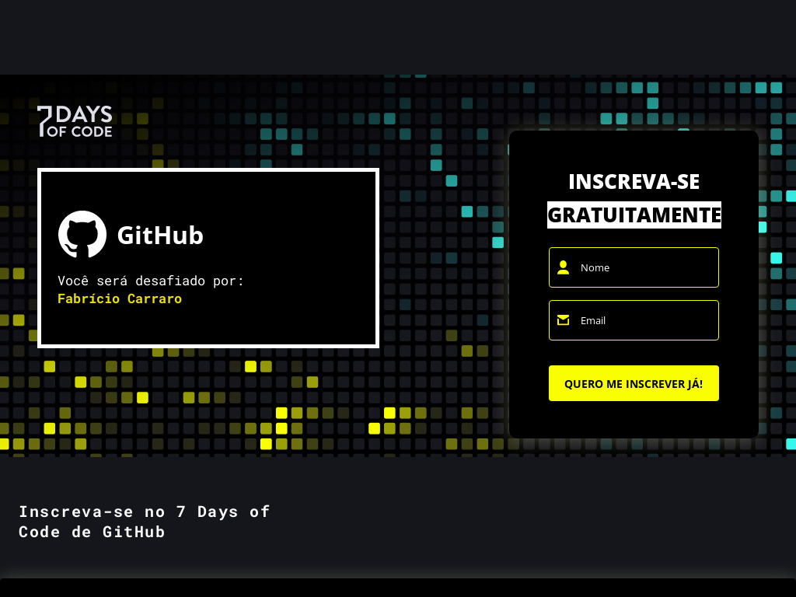

# 🐱🐙 Semana de GitHub da Alura

"Durante os 7 Days de GitHub, você vai praticar algo que além de importantíssimo, será muito divertido. Você irá criar, do zero, um repositório no GitHub usando um template. Posteriormente, você irá começar a fazer requisições para esse repositório, tanto manualmente quanto através da IDE do Visual Studio Code. Você irá trabalhar com muitos conceitos que colocarão à prova os seus conhecimentos de GitHub"

> Visualização da página para se inscrever no 7 Days Of Coode de GitHub da Alura.

## 📝 Progressos
Você pode checar a descrição dos desafios e ver meu progresso em: [Progressos](progressos)

## 📅 Cronograma
### Dia 1
Já no primeiro dia, você vai criar manualmente o seu repositório no GitHub. Você também irá alterar o arquivo ReadMe do seu perfil.
### Dia 2
Nesse dia, você irá subir manualmente arquivos e imagens para o seu repositório recém-criado do GitHub.
### Dia 3
Aqui, você começará a usar a IDE do Visual Studio Code. O seu desafio será clonar o seu repositório criado no GitHub para editá-lo localmente, na IDE.
### Dia 4
Esse é o dia mais trabalhoso! Inicialmente, você irá alterar o código para deixá-lo mais personalizado. Feito isso, você terá que realizar o commit dessas alterações, tanto usando a IDE quanto comandos no Terminal do Visual Studio Code.
### Dia 5
Nesse dia, o seu objetivo será criar e publicar no repositório um commit errado e, posteriormente, revertê-lo, a fim de remover o erro do seu código.
### Dia 6
Hoje você vai lidar com conflitos. Inicialmente, forçaremos commits a partir de duas fontes diferentes. O seu desafio será resolver esse conflito e fazer um commit do resultado do seu merge.
### Dia 7
No sétimo e último dia do desafio, você irá colocar o seu projeto em produção usando o GitHub Pages do próprio GitHub. Você irá fechar com chave de ouro!

[⬆ Voltar ao topo](#-semana-de-github-da-alura)
