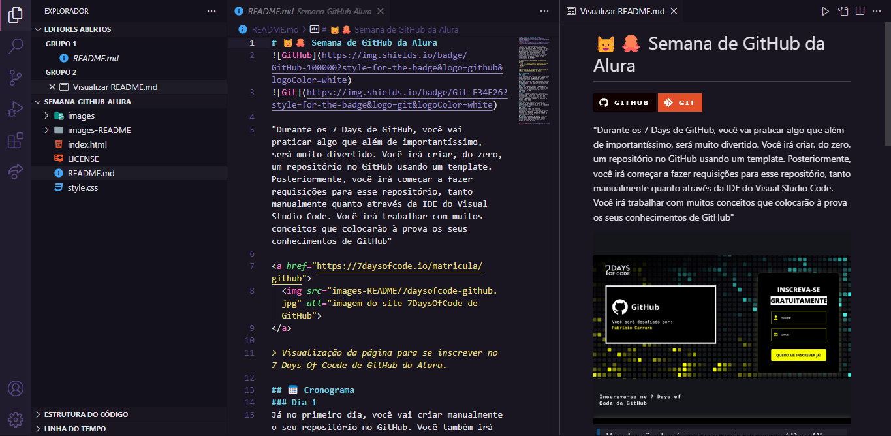
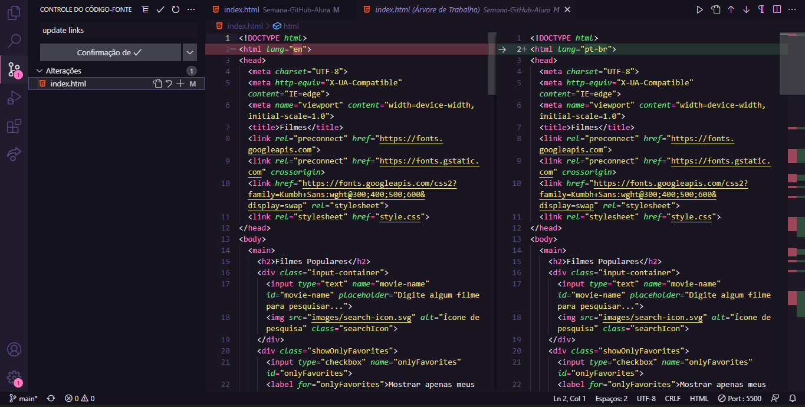
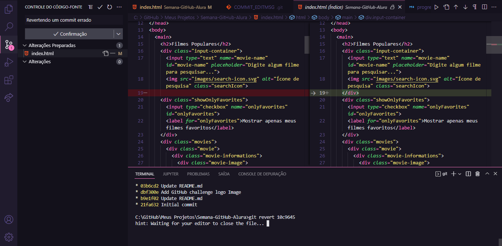
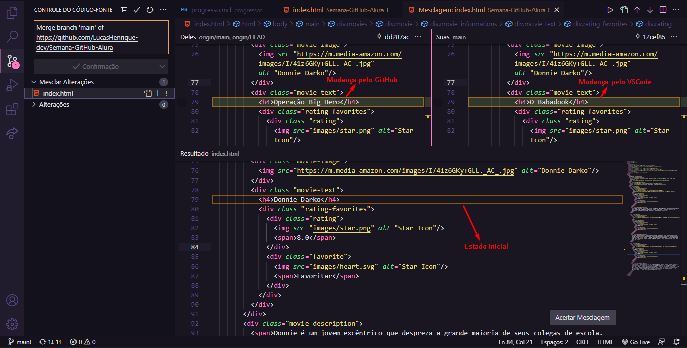

# 📝 Progressos

## ℹ️ Conteúdos
- [Proposta](#-proposta)
- [1° Dia](#-1-dia)
- [2° Dia](#-2-dia)
- [3° Dia](#-3-dia)
- [4° Dia](#-4-dia)
- [5° Dia](#-5-dia)
- [6° Dia](#-6-dia)

## 🎯 Proposta
Esta página é dedicada a mostrar de forma visual e fácil o progresso que venho obtendo durante os desafios diários.

---
### 📅 1° Dia
- Tarefa: "Considerando que você já tem uma conta criada no GitHub, o seu desafio de hoje será bem básico: criar um repositório do zero a partir da própria página do GitHub.

    Para fazer isso, é muito fácil. Estando na sua página de perfil, você vai clicar na aba "Repositories" (Repositórios) e em "New". Lá dentro, você vai escolher o nome do seu novo repositório, se ele terá um arquivo "Readme", entre outras coisas."

Você pode checar o progresso desse dia pelo próprio repositório 😉

---
### 📅 2° Dia
- Tarefa: "A primeira parte do seu desafio hoje será criar no seu repositório os arquivos HTML e CSS que eu compartilhei no template acima, mas isso será feito diretamente a partir da própria página do seu repositório no GitHub, copiando e colando o código manualmente. Assim que cada arquivo for criado, você deverá realizar o commit do mesmo, ao final da página.

    A segunda parte do desafio será fazer o upload de uma pasta "images" para o repositório, contendo as 4 imagens compartilhadas no template acima."

Você pode checar o progresso desse dia pelo próprio repositório 😉

---
### 📅 3° Dia

- Tarefa: "Hoje, você vai começar a usar uma IDE para continuar brincando com o seu repositório. Recomendo o uso do [Visual Studio Code, que você pode baixar aqui](https://code.visualstudio.com/download).

    Para poder conectar a sua conta GitHub ao Visual Studio Code, você terá que fazer o [download e instalação do Git](https://git-scm.com/downloads?utm_source=ActiveCampaign&utm_medium=email&utm_content=%237DaysOfCode+-+GitHub+3%2F7%3A+Clonando+um+repositório&utm_campaign=%5BAlura+%237Days+Of+Code%5D%28GitHub+-+1ª+Ed+%29+Dia+3%2F7) também.

    Tendo tudo isso instalado, o seu desafio de hoje será **clonar o seu repositório criado no GitHub para editá-lo localmente, pela sua IDE**."

> Repositório do GitHub clonado para a IDE Visual Studio Code 

---
### 📅 4° Dia

- Tarefa: "A primeira parte do seu desafio de hoje será **alterar o arquivo "index.html" a partir do Visual Studio Code para que você tenha três filmes diferentes, cada um com a sua descrição, imagem e nota correspondente**.

    A segunda e mais importante parte do desafio de hoje será **realizar o commit dessas alterações que você fez no código**. Você fará o commit diretamente a partir da aba "**Source Control**" do Visual Studio Code e passando uma mensagem explicando sobre o que se tratam as alterações."

> Visualização das alterações realizadas no código, diretamente da IDE Visual Studio Code

---
### 📅 5° Dia

- Tarefa: "Primeiramente, você irá abrir o seu arquivo "index.html" no Visual Studio Code. Altere algo que vá quebrar o seu código (como o fechamento de uma ‘div’ ou de um ‘h2’) e faça o commit e o Push dessas alterações para a sua master. Pode tentar abrir o "index.html" para ver o erro.

    O seu desafio de hoje será **reverter esse commit para remover o erro do seu código**."

> Visualização do comando "Revert" sendo aplicado, diretamente da IDE Visual Studio Code

---
### 📅 6° Dia

- Tarefa: "Acesse a página do seu repositório no GitHub e abra o arquivo "index.html". Clique no lápis para editá-lo e altere o texto de descrição do terceiro filme da lista. Ao terminar, vá até o final da página, insira uma mensagem e clique em "Commit changes", deixando selecionada a opção "Commit directly to the main branch".

    Agora, abra o seu arquivo "index.html" dentro do Visual Studio Code, vá até o mesmo ponto do código e altere o texto de descrição do terceiro filme da lista por um texto diferente do original e também diferente do texto alterado diretamente no GitHub. Salve o arquivo, vá até a aba "Source Control", insira uma mensagem e faça o commit dessas alterações (seja clicando no símbolo de "correto" ou usando o atalho "CTRL+Enter" ou "Command+Enter".

    Agora, ainda na aba "Source Control", clique nas reticências (...) e selecione a opção "Pull". Você verá que, ao fazer isso, a IDE irá te informar que houve um conflito de "merge" (mescla).

    O seu desafio de hoje será **resolver esse conflito e fazer um commit do resultado do seu "merge"**. Dê preferência para realizar esse desafio usando os comandos diretamente no Terminal do Visual Studio Code."

> Visualização do conflito causado por alterações no código, diretamente da IDE Visual Studio Code

[⬆ Voltar ao topo](#-progressos)
